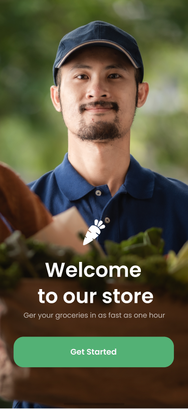
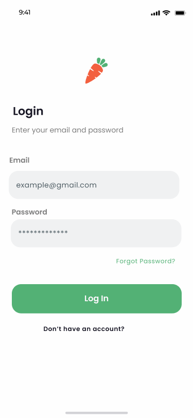
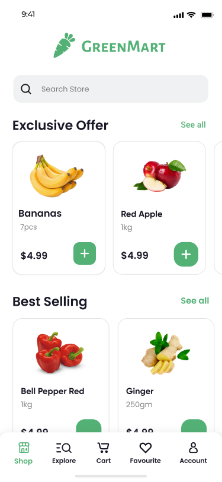
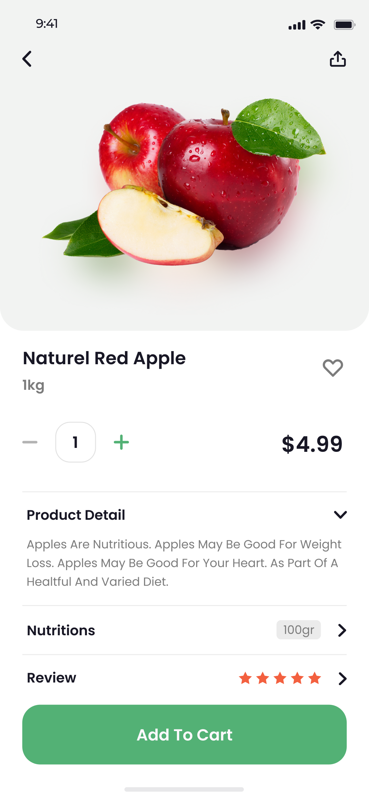
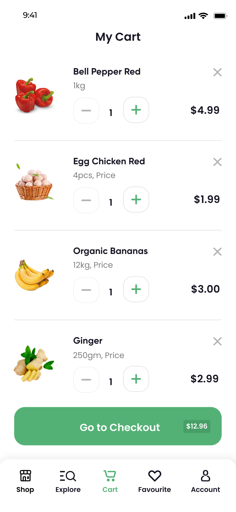
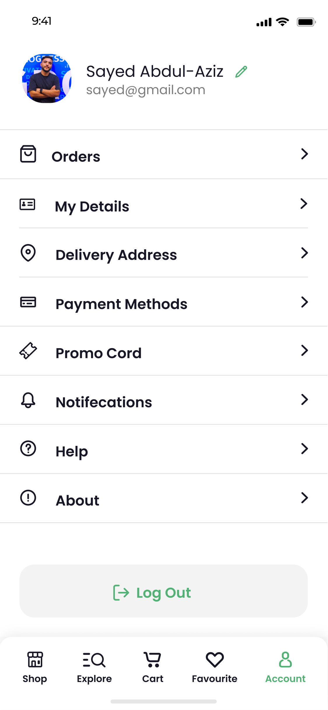

# 🛒 Green Mart — Grocery & Organic Delivery Mobile App

<p align="center">
  
</p>

<p align="center">
  <a href="https://flutter.dev"></a>
  <a href="https://dart.dev"></a>
  <a href="https://www.figma.com/design/IZVjhYZ4TqXRsm4uUXugdV/GreenMart?node-id=1-1300"></a>
  
</p>

---

## 📖 About The Project

**Green Mart** is a modern, responsive cross-platform mobile application designed and developed for seamless grocery shopping and organic food delivery. Built with **Flutter**, the app turns high-fidelity UI/UX concepts into a scalable, high-performance user experience.

> 🎨 **Figma Prototype & Design:** [Explore Figma Design File](https://www.figma.com/design/IZVjhYZ4TqXRsm4uUXugdV/GreenMart?node-id=1-1300&t=j62LovNqxnWRMWv9-0)

---

## 📱 Screenshots & UI Showroom

Create a folder named `screenshots` inside your repo and place your exported screen images there:

| 1. Onboarding & Splash | 2. Authentication | 3. Home & Explore |
| :---: | :---: | :---: |
|  |  |  |

| 4. Product Details | 5. Cart & Order | 6. Checkout & Profile |
| :---: | :---: | :---: |
|  |  |  |

---

## ✨ Key Features

- **Intuitive UI/UX Flow:** Pixel-perfect implementation based on the GreenMart Figma design system.
- **Onboarding Experience:** Clean introductory slides for smooth first-time user engagement.
- **Authentication & Authorization:** Secure user sign-up, sign-in, and session handling.
- **Dynamic Catalog & Search:** Categorized goods (Fresh Vegetables, Fruits, Dairy, Bakery) with instant filtering.
- **Cart & Order Workflow:** Quantity counters, dynamic subtotal calculations, and checkout validation.
- **Order Tracking & Profile:** Comprehensive account management and past order history.

---

## 🛠️ Architecture & Tech Stack

- **Framework:** [Flutter](https://flutter.dev) (Dart)
- **Architecture:** Feature-first / Clean Architecture with strict separation of presentation, domain, and data layers.
- **State Management:** BLoC / Cubit pattern
- **Design & Assets:** [Figma Design System](https://www.figma.com/design/IZVjhYZ4TqXRsm4uUXugdV/GreenMart?node-id=1-1300&t=j62LovNqxnWRMWv9-0), Flutter SVG, Google Fonts

---

## 📂 Project Structure

```text
lib/
├── core/
│   ├── constants/       # App assets, colors, and string constants
│   ├── theme/           # Light & dark theme palettes
│   └── utils/           # Helper functions & validation logic
├── features/
│   ├── auth/            # Sign in, Sign up, OTP verification
│   ├── home/            # Dashboard, banners, product cards
│   ├── product/         # Product view, ratings, specifications
│   ├── cart/            # Bag items, pricing breakdown
│   └── profile/         # User information & settings
└── main.dart
